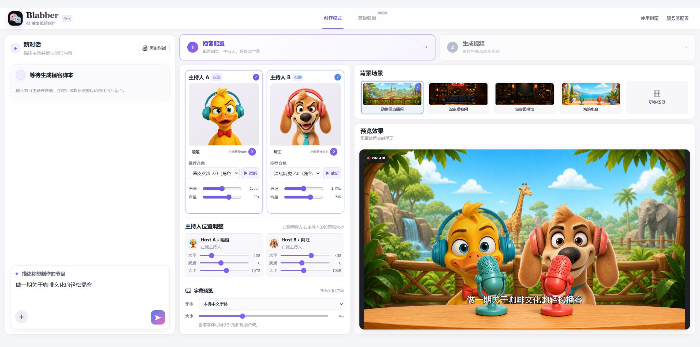
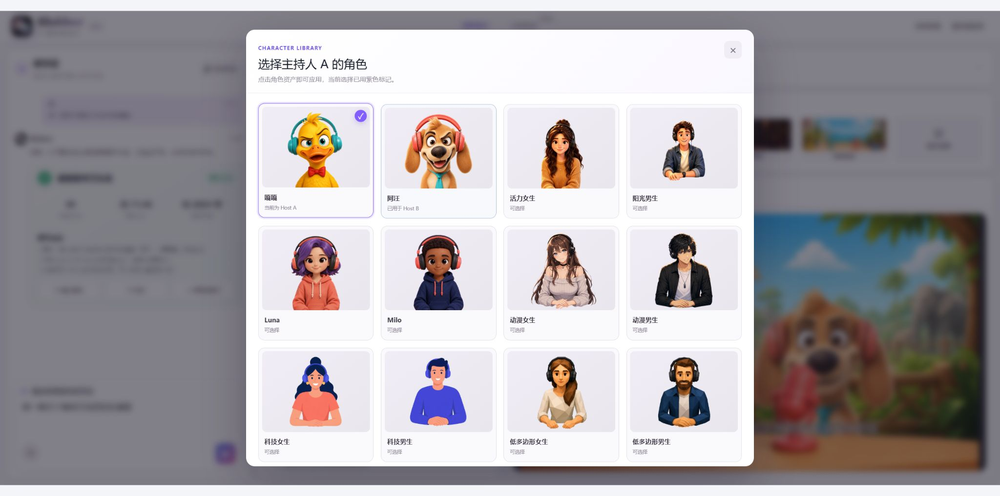
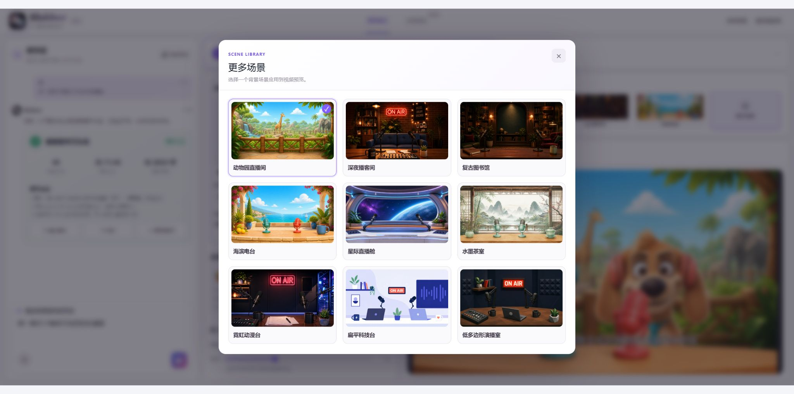
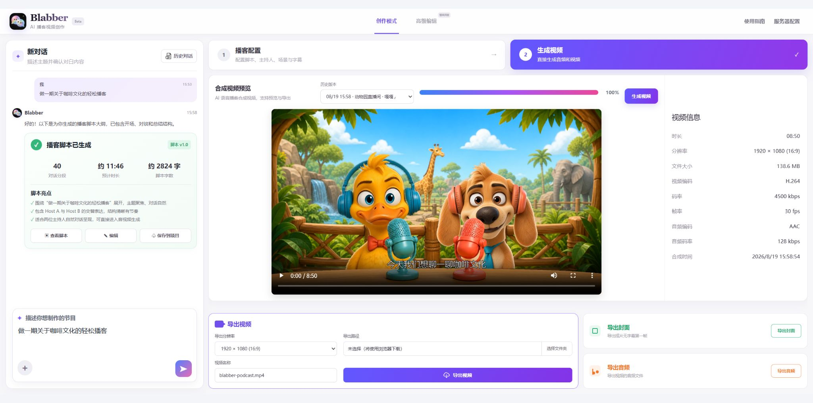
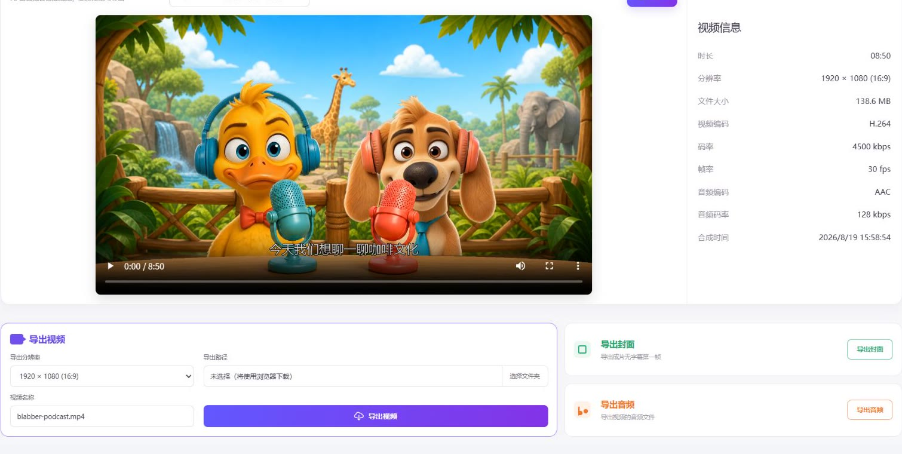

<div align="center">

<!-- 👇 在这里替换成你的封面 Banner 图 -->


# Blabber 🎙️

### The First Agentic Podcast Video Generation Platform

**One prompt. A full animated podcast show — dialogue, voices, lip sync, cameras, final cut. Fully automated, end to end.**


[](https://github.com/GML-MMGroup/Blabber)
[](https://github.com/GML-MMGroup/Blabber/releases)


**English** · [简体中文](./README_zh.md) · [Live Demo](#) · [Documentation](#)

</div>

---

## 🎬 Product Trailer

<!-- Product trailer pending release. -->

> Just type one sentence — *"Make a podcast about coffee culture"* — and Blabber writes the dialogue, casts two hosts, voices every line, syncs every lip movement to the audio waveform, directs the cameras, and renders the final cut. **You describe the show. The agents make it.**

---

## 📰 News

- **[2026-07-21]** 🎉 Blabber officially launched on GitHub!
- **[2026-08-07]** 🚀 Released the first version with the Zoo scene and two video-ready hosts: Gaga and Awang.
- **[2026-08-20]** ✨ Major update since August 7: added Luna, Milo, and more scenes; expanded dual-host voice controls and script, subtitle, and timeline editing; introduced parallel rendering, clearer generation feedback, LAN deployment, and improved audio/video sync stability.

<!-- 后续更新持续追加到这里 -->

---

## 🌟 Showcase — Shows Across Topics

> Six 12-second excerpts from animated podcast episodes generated with Blabber.

<table>
<tr>
<td width=33% align=center>
<strong>🧚 Fairy Tale</strong>

https://github.com/user-attachments/assets/6274e261-fea9-4d0d-add0-4d51e6aa4584

</td>
<td width=33% align=center>
<strong>💞 Modern Relationships</strong>

https://github.com/user-attachments/assets/58d03bf6-3e9e-4d61-b20f-d42436f3f094

</td>
<td width=33% align=center>
<strong>🗣️ Low-EQ Behaviors</strong>

https://github.com/user-attachments/assets/06caadb8-45d2-446a-a4e2-08f43bdbbb83

</td>
</tr>
<tr>
<td width=33% align=center>
<strong>🏛️ Government Policy Explainer</strong>

https://github.com/user-attachments/assets/028075e9-f092-4bbe-af21-8bfddf082234

</td>
<td width=33% align=center>
<strong>☕ Coffee Culture</strong>

https://github.com/user-attachments/assets/3ed13a6b-0850-4b57-b7ab-07f900d278a6

</td>
<td width=33% align=center>
<strong>🚗 New Car</strong>

https://github.com/user-attachments/assets/1347eb74-3b3b-48f0-8e8a-27179794001a

</td>
</tr>
</table>

---

## 💡 What is Blabber?

Blabber is an **AI production platform built for podcast video creation**. You don't record, animate, or edit anything — you just describe the show you want, and a team of AI agents orchestrates the entire journey: **topic planning → dialogue script → voice casting → speech synthesis → lip sync → camera direction → editing → final render.**

It's not just a one-shot video generator. Blabber turns every show into an **editable project**: after generation, you can keep refining anything — a line of dialogue, a host's voice, a camera cut, a scene — through the built-in AI Copilot chat or directly on the clip-based timeline.

### From topic to finished video

<table>
<tr>
<td align="center"><strong>1. Describe the show</strong><br><sub>Enter a topic or upload source material.</sub><br></td>
</tr>
<tr>
<td align="center"><strong>2. Review the script</strong><br><sub>Check the generated outline, dialogue count, and estimated length.</sub><br></td>
</tr>
<tr>
<td align="center"><strong>3. Choose the hosts</strong><br><sub>Pair the show with characters and matching voices.</sub><br></td>
</tr>
<tr>
<td align="center"><strong>4. Select a scene</strong><br><sub>Pick a visual style and preview the composition.</sub><br></td>
</tr>
<tr>
<td align="center"><strong>5. Preview the video</strong><br><sub>Review the finished episode and its render details.</sub><br></td>
</tr>
<tr>
<td align="center"><strong>6. Export the result</strong><br><sub>Export the video, cover image, or audio track.</sub><br></td>
</tr>
</table>

---

## ✨ Core Features

- **End-to-end generation** — turn one prompt or document into a two-host script, voices, animation, captions, camera cuts, and a finished episode.
- **Natural two-host conversation** — generate character-matched voices, reactions, follow-up questions, and editable line-by-line audio clips.
- **Automated visual production** — frame-accurate lip sync, speaker-aware camera direction, and final FFmpeg composition.
- **Conversational editing** — revise scripts, voices, shots, and timing through AI Copilot or the clip-based timeline, with candidate versions and rollback.
- **Flexible presentation** — mix bundled characters and scenes, then export captioned videos for widescreen, vertical, or square platforms.

---

## 🛠️ Complete Local Installation

Prerequisites:

- Git
- Node.js `>=22.13.0`
- Python `>=3.9`
- `ffmpeg` and `ffprobe` available on `PATH`, with `libvpx-vp9` support
- About 1 GB of free disk space for runtime caches and output. The bundled
  VP9 Alpha action assets add about 52 MB to the regular Git clone; Git LFS is
  not required.

First-time setup:

```bash
git clone https://github.com/GML-MMGroup/Blabber.git
cd Blabber

python3 -m venv .venv
source .venv/bin/activate
python -m pip install --upgrade pip
python -m pip install -r mvp/requirements.txt
cp mvp/.env.example mvp/.env

cd site
npm ci
```

On Windows PowerShell, activate with `.venv\Scripts\Activate.ps1` and create
the configuration file with `Copy-Item mvp/.env.example mvp/.env`.

If PowerShell blocks `npm.ps1` because of its execution policy, use `npm.cmd` for the documented npm commands (for example, `npm.cmd ci` and `npm.cmd run dev`). Verify the prerequisites before setup with `node --version`, `python --version`, `ffmpeg -version`, and `ffprobe -version`. Video segments are rendered concurrently: action video defaults to at most 4 workers and lip-sync video to at most 2. Set `BLABBER_VIDEO_WORKERS` in `mvp/.env` to a positive integer to override both; lower it if CPU, memory, or GPU memory is limited.

The web UI uses Volcengine PodcastTTS to return two-host dialogue slices, per-slice MP3 files, and the complete MP3 in one API request, ready for MP4 generation. After setup, start the two local services in separate terminals.

Terminal 1 — backend:

```bash
cd Blabber
source .venv/bin/activate
cd site
npm run dev:mvp
```

Terminal 2 — frontend:

```bash
cd Blabber
cd site
npm run dev
```

Open the local URL printed in the terminal (normally `http://localhost:3000`). Configure the Doubao Speech PodcastTTS App ID and Access Token under service settings. To use Seedream or Seedance, additionally run `python -m pip install -r mvp/requirements-ark.txt` and set the optional `ARK_API_KEY` in `mvp/.env`. This credential file is ignored by Git and must not be committed.

Enter a topic or select a document, then click **Generate script and audio**. Once audio is ready, continue with MP4 generation using the bundled Gaga and Awang characters in the Zoo scene.

---

## 🚀 Production deployment

The `site/` directory is configured for OpenAI Sites. From that directory, run `npm ci` and `npm test` before publishing through Sites. The checked-in `.openai/hosting.json` identifies the existing Sites project; do not replace its `project_id`. Optimize large tracked static assets before publishing; oversized images or an excessive source payload may cause the Sites source push to be rejected.

Sites publishes the web UI and its Worker only. The Python service in `mvp/` performs PodcastTTS calls, media persistence, FFmpeg processing, and MP4 rendering, and is **not** included in the Sites deployment. The development proxy in `site/vite.config.ts` forwards `/api/mvp` and `/mvp-media` to `127.0.0.1:8787` only while running locally. A functional public deployment therefore requires a separately hosted Python backend plus a production reverse proxy (or equivalent same-origin routing) for those two paths. Never expose `mvp/.env` or put API credentials in frontend environment variables.

---

## 📚 Document Ingestion API

`POST /api/mvp/document-jobs` uses PodcastTTS document mode (`action=0`) and accepts a webpage or downloadable document URL, long text, or a local file. The UI accepts `.txt`, `.md`, `.html`, `.json`, `.csv`, `.docx`, and `.pdf` files up to 20 MB and shows the selected file name and size:

```bash
curl -X POST http://127.0.0.1:8787/api/mvp/document-jobs \
  -H 'Content-Type: application/json' \
  -d '{"input_url":"https://example.com/article","topic":"Article explainer"}'
```

Alternatively, use `{"input_text":"Document body...","topic":"Document explainer"}` or upload a Base64 file with `{"file_name":"report.pdf","file_base64":"...","topic":"Report explainer"}`. Provide exactly one of `input_url`, `input_text`, or the file upload fields; `topic` is optional. Scanned PDFs must be OCRed first. The endpoint returns `202` with a job ID. Poll `GET /api/mvp/jobs/{id}`; the completed job includes `episode.turns`, `clips[].audio_url`, `audio_url`, and `provider_audio_url`.

Jobs are persisted in `mvp/output/jobs-history.json`; read recent records from `GET /api/mvp/history`. The UI can restore saved scripts, audio slices, and videos, while identical new inputs reuse completed results without another paid request. During generation, `GET /api/mvp/jobs/{id}/events` streams accumulated script and audio slices over SSE.

<div align="center">

**⭐ If you find Blabber useful, please give us a star!**

Made with ❤️ by the Blabber Team

</div>
